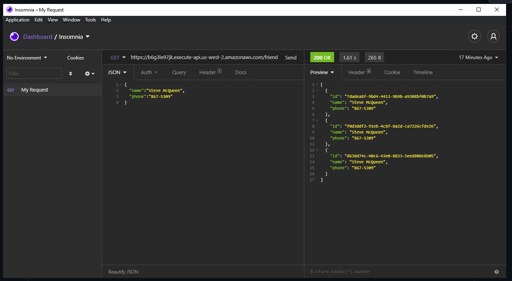
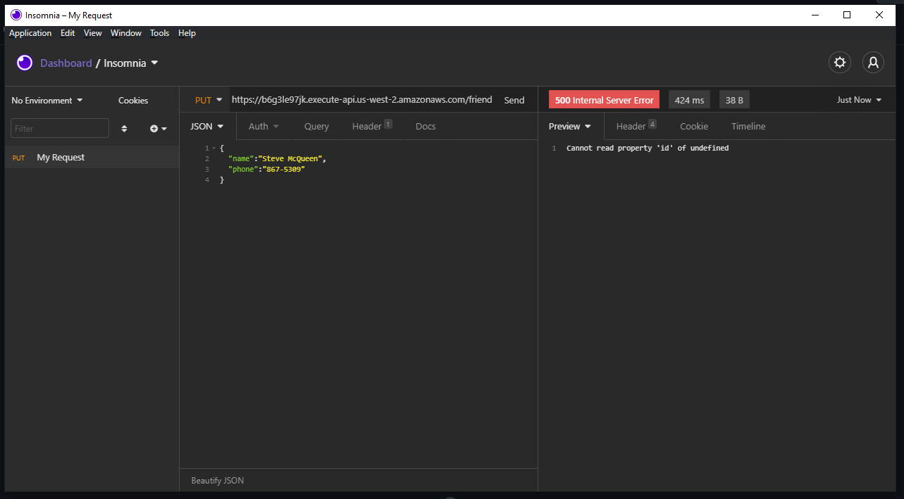
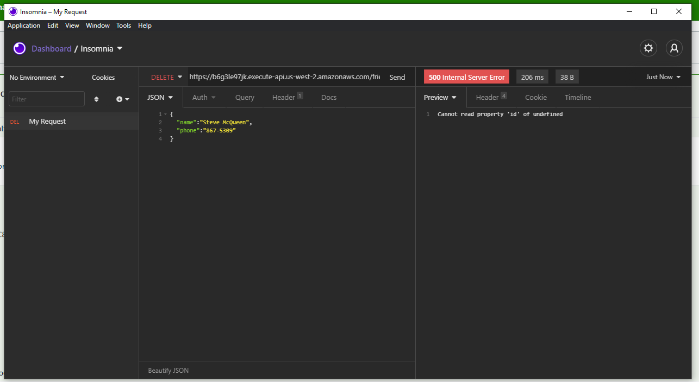

# Lab 18 - AWS DYNAMO API DEPLOYMENT

### REPO LINKS
- GET: https://github.com/Rtipper/dynamo-get-lab18
- PUT: https://github.com/Rtipper/dynamo-put-lab18
- DELETE: https://github.com/Rtipper/dynamo-delete-lab18

### Insomnia Test Images

### AWS Images

##### Lambda Function

##### DynamoDB/Table

##### API Routes/Integration

